## `SwiftUI` Examples


### About

Examples projects using `SwiftUI` & `Combine`.  
Include Layout, UI, Animations, Gestures, Draw and Data.

See projects files in `Files` & `Other Projects` folders. If you have project, make a pull request or create issue with link to repo.

Interested in UI and animations in `UIKit`?  
See [awesome-ios-ui](https://github.com/ivanvorobei/awesome-ios-ui) pack with UI elements.

If you like the project, don't forget to `put star ★` and follow me on GitHub:

### Community

<p float="left">
    <a href="https://twitter.com/sparrowcode_en">
        
    </a>
    <a href="https://t.me/sparrowcode_en">
        
    </a>
    <a href="https://mastodon.social/@sparrowcode_en">
        
    </a>
    <a href="#apps-using">
        
    </a>
</p>

## Navigate

- [Animatable Cards](#animatable-cards)
- [Area to Card](#area-to-card)

#### Other projects

- [Transition And Blur](#transition-and-blur)
- [2048 Game](#2048-game)
- [SFSymbols](#sfsymbols)
- [Calculator](#calculator)
- [Creating And Combining Views](#creating-and-combining-views)
- [Building Lists And Navigation](#building-lists-and-navigation)
- [Handling User Input](#handling-user-input)
- [WWDCPlayer](#WWDCPlayer)
- [Composing Complex Interfaces](#composing-complex-interfaces)
- [Working With UIControls](#working-with-uicontrols)
- [Example To-Do App](#example-to-do-app)
- [iPadOS Scenes](#ipados-scenes)
- [Combine using GitHub API](#combine-using-github-api)
- [Async image loading](#async-image-loading)
- [Interfacing With UIKit](#interfacing-with-uikit)
- [GitHub Search](#github-search)
- [Time Travel](#time-travel)
- [Drawing Paths And Shapes](#drawing-paths-and-shapes)
- [Animating Views And Transitions](#animating-views-and-transitions)
- [Jike](#jike)
- [Flux](#flux)
- [PureGenius](#puregenius)
- [SwiftUI Download Progress View](#SwiftUIDownloadView)
- [SwiftUI SideMenu](#SwiftUI-SideMenu)
- [SwiftUI Currency App](#SwiftUI-Currency)
- [SwiftUI Weather App](#SwiftUI-Weather)
- [DesignCode SwiftUI App](https://github.com/mythxn/DesignCode)
- [SwiftUI SlideToOpen](#MTSlideToOpen-SwiftUI)
- [Currency Converter & Calculator](#transition-and-blur)
- [FlipClock-SwiftUI](#FlipClock-SwiftUI)
- [Countdown Film Clutter](#CountdownFilmClutter-SwiftUI)
- [SpotlightSearch](#SpotlightSearch)
- [Growing text view in SwiftUI](#Growing-text-view-in-SwiftUI)
- [Calculator Clone for iPadOS](https://github.com/bofeiw/ios-calculator-clone-for-ipados)
- [MGFlipView](#MGFlipView)

Also include:
- Movie
- InstaFake
- TempusRomanumII
- SwiftUI + Redux
- React Meets SwiftUI
- Webview
- UINote
- SplitView
- Card Animation

## Animatable Cards


#### 3D

For add 3D rotation for back cards use code:

```swift
.rotation3DEffect(
	Angle(degrees: dragState.isActive ? 0 : 60), axis: (x: 10.0, y: 10.0, z: 10.0)
 )
```

For medium card use 30 angles.

#### Animation

In preview I am use `Spring` animation for all cards:

```swift
.animation(.spring())

```

## Area to Card

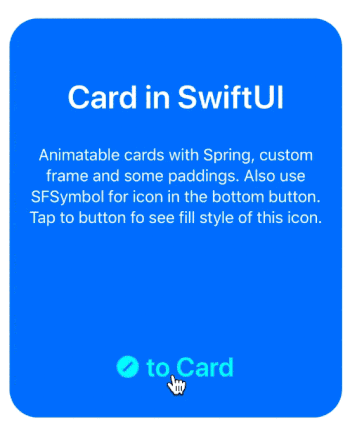

#### SFSymbols

For button using `SFSymbols` pack with ready-use icons. Also support customisable weight:

```swift
Image(systemName: show ? "slash.circle.fill" : "slash.circle")
   .font(Font.title.weight(.semibold))
```

#### Button

For change state using `@State` as property:

```swift
@State var show = false
```

## Transition And Blur

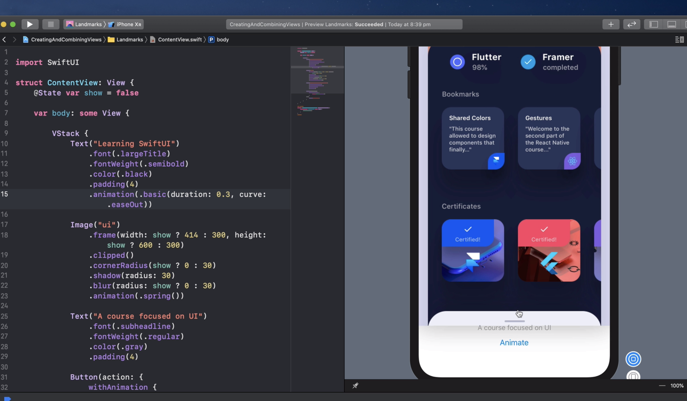

## 2048 Game

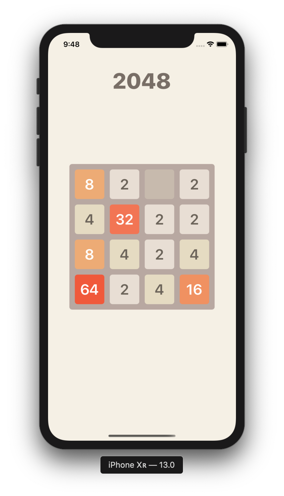

## SFSymbols

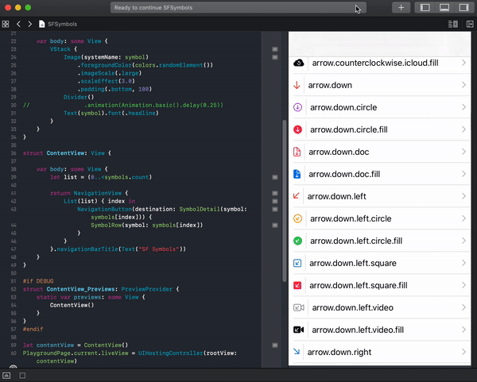

## Calculator


## Creating And Combining Views


## Building Lists And Navigation


### WWDCPlayer


### Handling User Input


### Composing Complex Interfaces


### Working With UIControls


### Example To-Do App

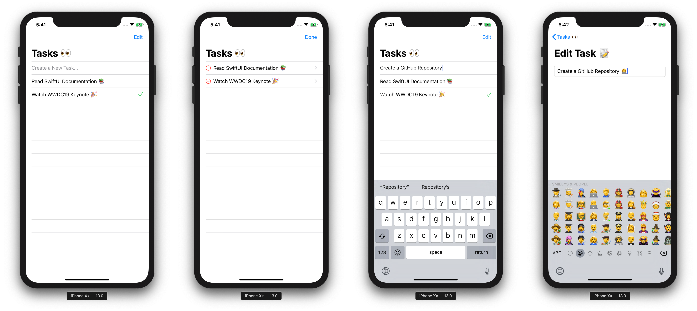

### iPadOS Scenes

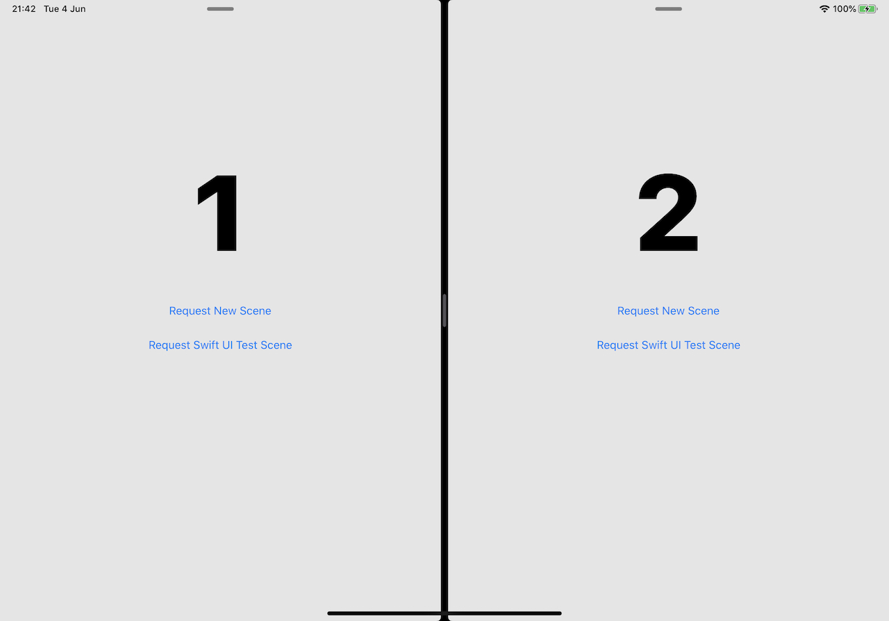

### Combine using GitHub API

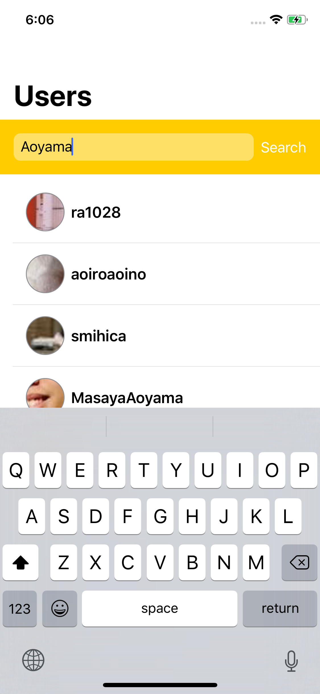

### Async image loading

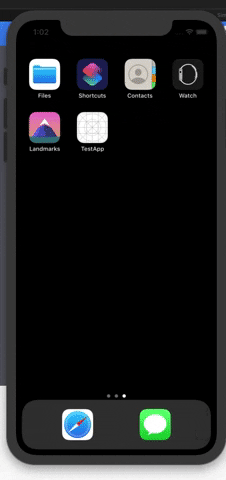

### Interfacing With UIKit


### GitHub Search

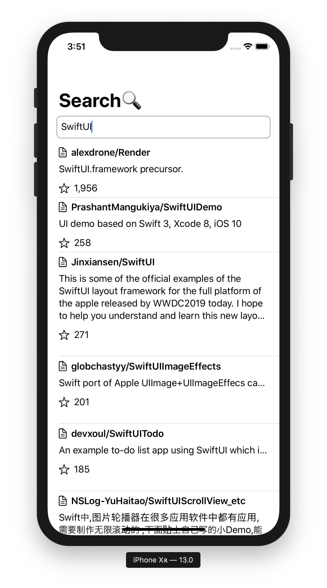

### Time Travel

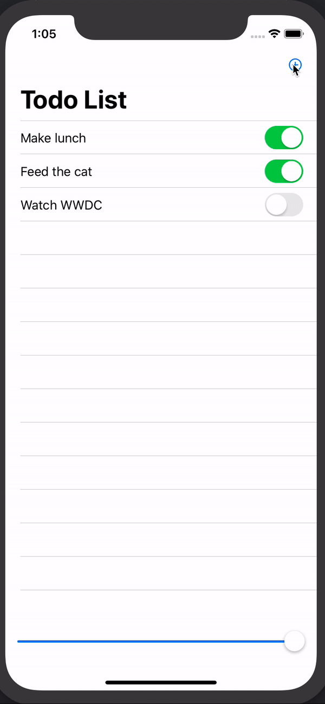

### Drawing Paths And Shapes


### Animating Views And Transitions


### Jike


### Flux

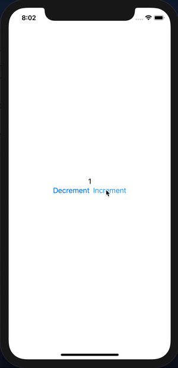

#### PureGenius

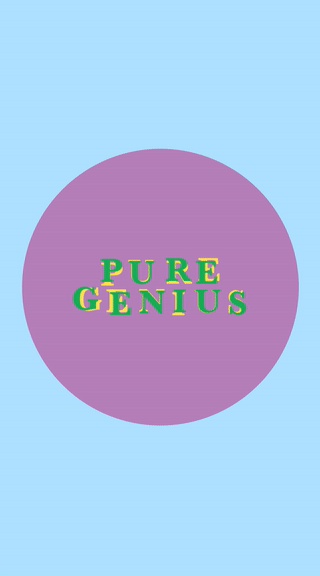

### SwiftUIDownloadView


### SwiftUI SideMenu

[Source](https://github.com/Vidhyadharan24/SideMenu)

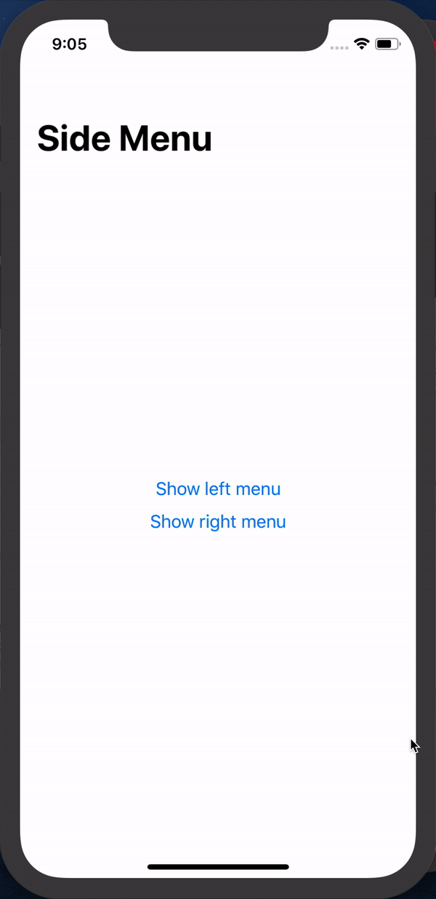

### SwiftUI Currency

[Source](https://github.com/alexliubj/SwiftUI-Currency-Converter)

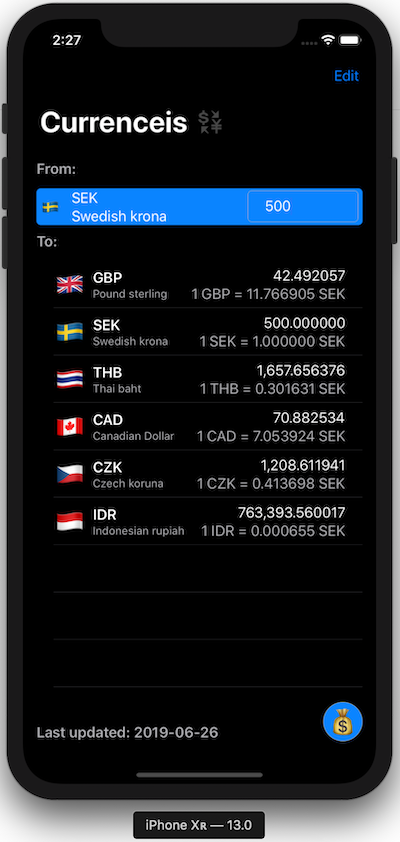

### SwiftUI Weather

[Source](https://github.com/bpisano/Weather) and [Tutorial](https://medium.com/lunabee-studio/building-a-weather-app-with-swiftui-4ec2743ff615)


### DesignCode SwiftUI
[Source](https://github.com/mythxn/DesignCode/tree/master)


### MTSlideToOpen-SwiftUI
[Source](https://github.com/lemanhtien/MTSlideToOpen-SwiftUI)

<a href="url"></a>

### Currency Converter & Calculator

[Source](https://github.com/CurrencyConverterCalculator/iosCCC)

 
### FlipClock-SwiftUI
[Source](https://github.com/elpassion/FlipClock-SwiftUI)

|Light|Dark|
|:-:|:-:|
|||

### CountdownFilmClutter-SwiftUI

[Source](https://github.com/elpassion/CountdownFilmClutter-SwiftUI)


### SpotlightSearch
[Source](https://github.com/boraseoksoon/SpotlightSearch)

|Light|Dark|
|:-:|:-:|
|||

### SwiftUI Weather App with MVVM and CoreML

[Source](https://github.com/necatievrenyasar/SwiftUI-WeatherApp)


### Growing text view in SwiftUI
[Source](https://github.com/Zaprogramiacz/GrowingTextView)


### MGFlipView
[Source](https://github.com/Zaprogramiacz/MGFlipView)


### Authors

Thanks for [Jinxiansen](https://github.com/Jinxiansen), [ra1028](https://github.com/ra1028), [timdonnelly](https://github.com/timdonnelly), [TwoLivesLeft](https://github.com/TwoLivesLeft), [devxoul](https://github.com/devxoul), [cmtrounce](https://github.com/cmtrounce), [unixzii](https://github.com/unixzii), [ra1028](https://github.com/ra1028) for examples project.

## Other Projects

I love being helpful. Here I have provided a list of libraries that I keep up to date. For see `video previews` of libraries without install open [opensource.ivanvorobei.by](https://opensource.ivanvorobei.by) website.<br>
I have libraries with native interface and managing permissions. Also available pack of useful extensions for boost your development process.

<p float="left">
    <a href="https://opensource.ivanvorobei.by">
        
    </a>
        <a href="https://xcodeshop.ivanvorobei.by">
        
    </a>
</p>

## Russian Community

Подписывайся в телеграмм-канал, если хочешь получать уведомления о новых туториалах.<br>
Со сложными и непонятными задачами помогут в чате.

<p float="left">
    <a href="https://tutorials.ivanvorobei.by/telegram/channel">
        
    </a>
    <a href="https://tutorials.ivanvorobei.by/telegram/chat">
        
    </a>
</p>

Видео-туториалы выклыдываю на [YouTube](https://tutorials.ivanvorobei.by/youtube):

[](https://tutorials.ivanvorobei.by/youtube)
